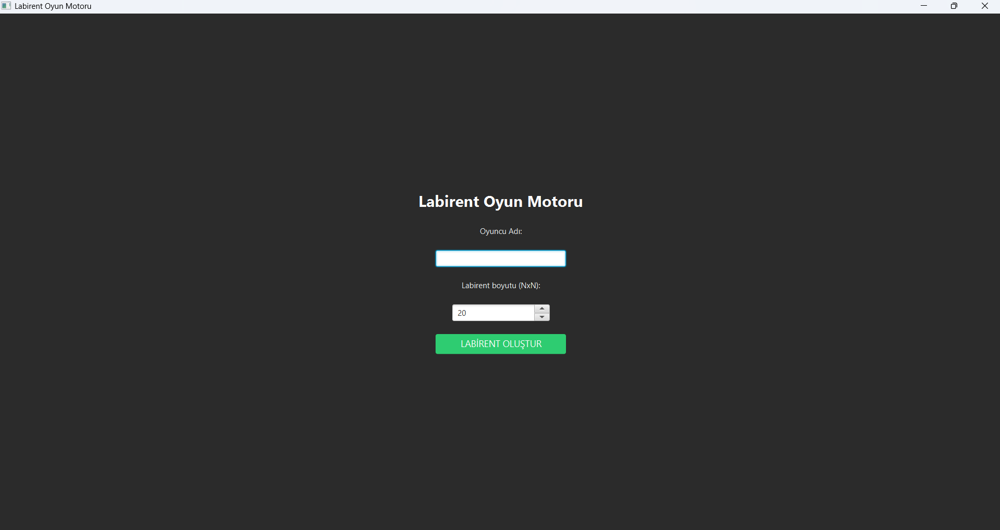
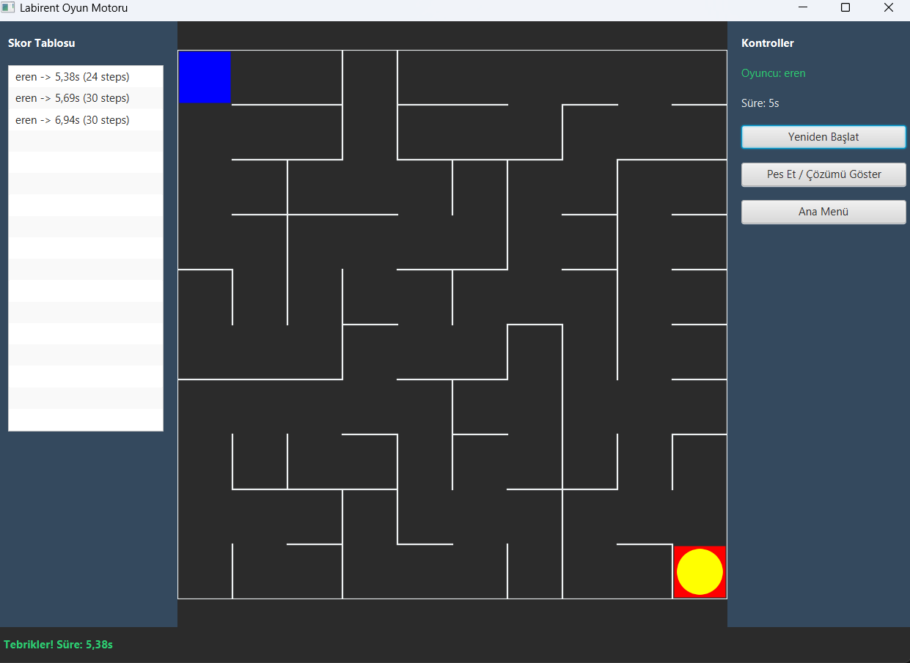
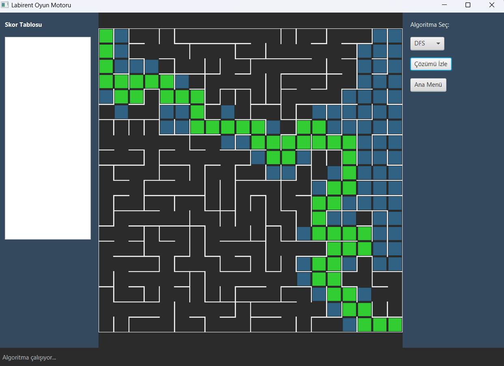

# 🎮 Labirent Oyun Motoru 

> **Veri Yapıları ve Algoritmalar Dersi Projesi** > Java ve JavaFX kullanılarak geliştirilmiş, hem oynanabilir bir oyun hem de algoritmik bir simülasyon aracı.

---

## 📖 Proje Hakkında

Bu proje, rastgele oluşturulan labirentlerde yön bulma algoritmalarını görselleştirmek ve kıyaslamak amacıyla geliştirilmiştir. Kullanıcılar isterlerse labirenti kendileri çözmeye çalışabilir veya yapay zeka algoritmalarının nasıl yol bulduğunu adım adım izleyebilirler.
Projenin temel amacı, **Stack, Queue, Heap, AVL Tree** gibi temel veri yapılarını ve **BFS, DFS, A\*, Kruskal** gibi algoritmaları "from scratch" (sıfırdan) implemente ederek gerçek bir senaryoda kullanmaktır.

---

## ✨ Özellikler

* **Rastgele Labirent Üretimi:** Kruskal Algoritması kullanılarak her seferinde benzersiz ve çözülebilir labirentler oluşturulur.
* **Oyun Modu:**
    * Klavye ile karakter kontrolü.
    * Süre ve adım takibi.
    * Skor tablosu.
* **Simülasyon & Analiz Modu:**
    * **BFS, DFS ve A\*** algoritmalarının adım adım görselleştirilmesi.
* **Gelişmiş Skor Sistemi:**
    * Skorlar **AVL Ağacı** üzerinde tutulur.
* **Dinamik Arayüz:** JavaFX ile modern, koyu tema (Dark Mode) tasarımı.

---

## 🛠️ Kullanılan Veri Yapıları ve Algoritmalar

Bu projede Java'nın hazır kütüphaneleri (örn. `java.util.Stack`) yerine, **kendi yazdığımız veri yapıları** kullanılmıştır.

### 1. Veri Yapıları
| Veri Yapısı | Kullanım Alanı | Dosya Yeri |
| :--- | :--- | :--- |
| **Stack** | DFS Algoritması | `src/main/java/com/labirent/datastructures/Stack.java` |
| **Queue** | BFS Algoritması. | `src/main/java/com/labirent/Queue.java` |
| **MinHeap** | A* Algoritması ve Kruskal (Kenar sıralama). | `src/main/java/com/labirent/datastructures/MinHeap.java` |
| **Union-Find** | Kruskal Algoritması (Döngü kontrolü). | `src/main/java/com/labirent/datastructures/UnionFind.java` |
| **AVL Tree** | Skor Tablosu (Verileri sıralı tutmak ve hızlı erişim). | `src/main/java/com/labirent/datastructures/AVLTree.java` |

### 2. Algoritmalar
| Kategori | Algoritma | Açıklama |
| :--- | :--- | :--- |
| **Yol Bulma** | **BFS** (Breadth-First Search) | En kısa yolu garanti eder. |
| | **DFS** (Depth-First Search) | Derinlemesine arama yapar, çözüm garanti ama en kısa yol değil. |
| | **A\* (A-Star)** | Heuristic (Manhattan) kullanarak hedefe en hızlı yönelen algoritma. |
| **Labirent** | **Kruskal** | Minimum Spanning Tree mantığıyla kusursuz labirent üretimi. |
---

## 📸 Ekran Görüntüleri


| Giriş Ekranı | Oyun Modu | Analiz Modu |
| :---: | :---: | :---: |
|  |  |  |

---

## 🚀 Kurulum ve Çalıştırma

### Gereksinimler
* **Java JDK 17** veya üzeri.
* **JavaFX SDK** (Eğer JDK içinde gömülü değilse).

### Adım Adım Çalıştırma

1.  Proje dosyasını indirin ve IDE ile açın.
2.  `src/Main.java` dosyasını bulun.
3.  **VM Options Ayarı (Önemli):**
    JavaFX'in çalışması için Run Configuration kısmında `VM Options` alanına JavaFX `lib` yolunu eklemelisiniz:
    ```bash
    --module-path "\path\to\javafx-sdk-21\lib" --add-modules javafx.controls,javafx.fxml
    ```
4.  Projeyi çalıştırın (Run).

---

## 🎮 Kontroller

* **W, A, S, D**: Karakteri hareket ettirir.
* **Fare**: Menü ve buton etkileşimleri.
  
---

## 👨‍💻 Geliştirici
-Muhammed Eren Sağırlı
-Ayberk Erem
